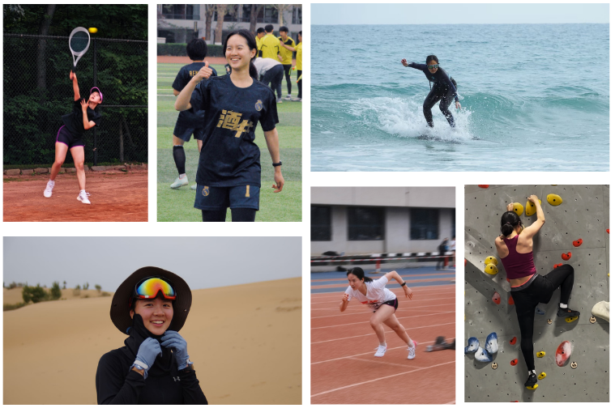
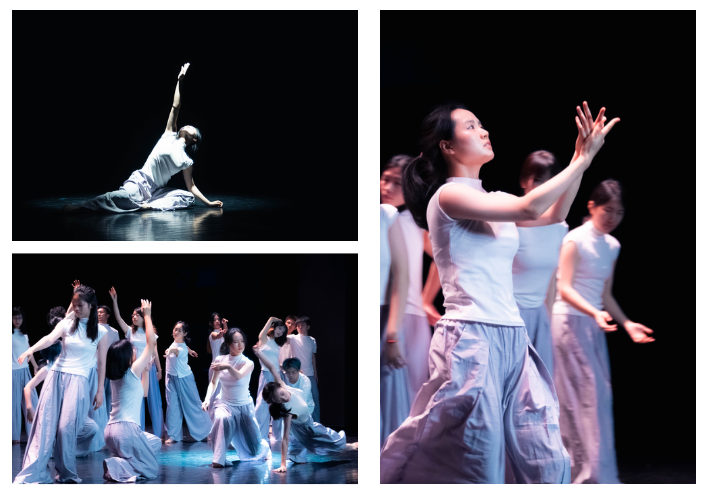

I'm a senior undergraduate at **Tsinghua University** in China, majoring in **Computer Science and Engineering**.

I’m deeply curious about the mysteries of life, summarized by **“who we are” both physically and mentally**, which has sparked my interest in biology and psychology.

I combined my computational background with my passion for biology, focusing on <u>leveraging AI and machine learning techniques to better understand life systems and solve biomedical problems</u>. I am currently applying to graduate programs in computer science / computational biology, aiming to further my academic journey in the US.

I am equally intrigued by the complexities of the human mind, such as how genetics and the environment determine our personality and mindset, and how our memories and internal monologues influence self-perception. I love <u>exploring the deeper, unconscious motivations behind our decisions and behaviors</u>, as I believe we often don’t fully understand ourselves.

Research Interets
======

- AI for Biology
- Multi-modal Machine Learning
- Biological Networks and Systems
- Drug Discovery and Therapuetics
- Interpretability

I am interested in developing **multi-modal machine learning methods** to **learn holistic and meaningful representations** of biological entities <i>in silico</i>. I aspire to uncover the mechanisms underlying **gene regulation** and **cell differentiation** by leveraging insights extracted from large-scale, integrative data through computational methods and analytical tools, ultimately advancing **disease treatments and therapeutics**.

For a more detailed account, please visit the [research](https://zhileibei.github.io/research) page.

Research Experiences
======

- Student Researcher at CMU, working with Prof. [Jian Ma](https://www.cs.cmu.edu/~jianma/) on **spatial transcriptomics**.
- Research Intern at [BioMap](https://www.biomap.com/en/), working on **protein language models**.
- Student Researcher at Tsinghua University, working with Profs. [Yuxiao Dong](https://keg.cs.tsinghua.edu.cn/yuxiao/) and [Jie Tang](https://keg.cs.tsinghua.edu.cn/jietang/) on **target-aware molecule generation**.
- Student Researcher at Tsinghua University, working with Prof. [Jianyang Zeng](https://en.westlake.edu.cn/faculty/jianyang-zeng.html) on **leveraging knowledge graphs for disease target prediction**.

For further details, please refer to my [CV](../files/Resume.pdf) and the [publications](https://zhileibei.github.io/publications) page.

Hobbies
======

Apart from my academic and intellectual interests, I’m a very energetic and adventurous person in life, with a wide range of hobbies and open to new experiences.

Sports
------

I love sports because it makes me feel alive and grounded in the moment, and also introduces me to amazing people.

- I’m a member of the Tsinghua **tennis** team, and I've won the women's team championship in the College Student Tennis Tournament in Beijing. 
- I'm the former captain of the women’s **soccer** team of my department, securing second place in the school soccer tournament three years in a row.
- I also enjoy running, hiking, skiing, surfing, bouldering, as well as playing pickleball and squash.

{: .align-center width="750px"}

Arts
------

I’m also deeply drawn to the arts, especially dance, music and theater. Art offers me profound emotional connections and moments of resonance that words often cannot achieve.

- I’ve danced **ballet** for 12 years and currently learning **modern dance** as a means of creative self-expression.
- I enjoy playing the **violin** and the **piano** in my spare time as a way to relax.
- I also love going to **musicals** and **drama performances**.

{: .align-center width="650px"}