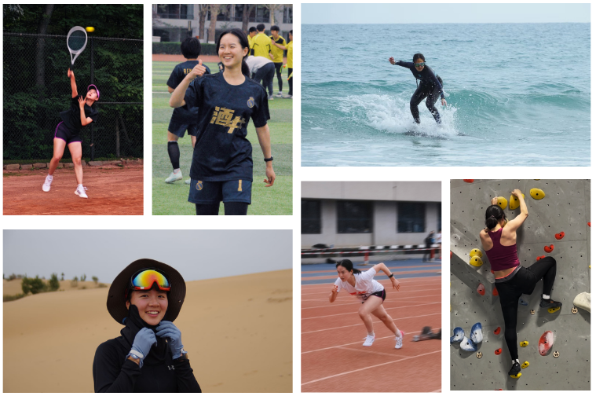
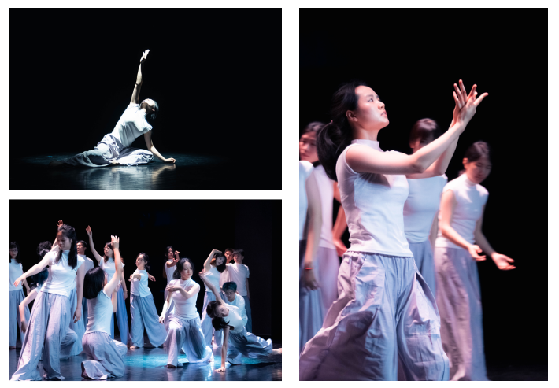

Apart from my academic and intellectual interests, I’m a very energetic and adventurous person in life, with a wide range of hobbies and open to new experiences.

Sports
------

I love sports because it makes me feel alive and grounded in the moment, and also introduces me to amazing people.

- I’m a member of the Tsinghua **pickleball** team, and I've won the women's doubles bronze medal in the National University Student Pickleball Tournament. 
- I’m a member of the Tsinghua **tennis** team, and I've won the women's team championship in the College Student Tennis Tournament in Beijing. 
- I'm the former captain of the women’s **soccer** team of my department, securing second place in the school soccer tournament three years in a row.
- I also enjoy running, hiking, skiing, surfing, bouldering, and squash.

{: .align-center width="750px"}

Arts
------

I’m also deeply drawn to the arts, especially dance, music and theater. Art offers me profound emotional connections and moments of resonance that words often cannot achieve.

- I’ve danced **ballet** for 12 years and currently learning **modern dance** as a means of creative self-expression.
- I enjoy playing the **violin** and the **piano** in my spare time as a way to relax.
- I also love going to **musicals** and **drama performances**.

{: .align-center width="650px"}